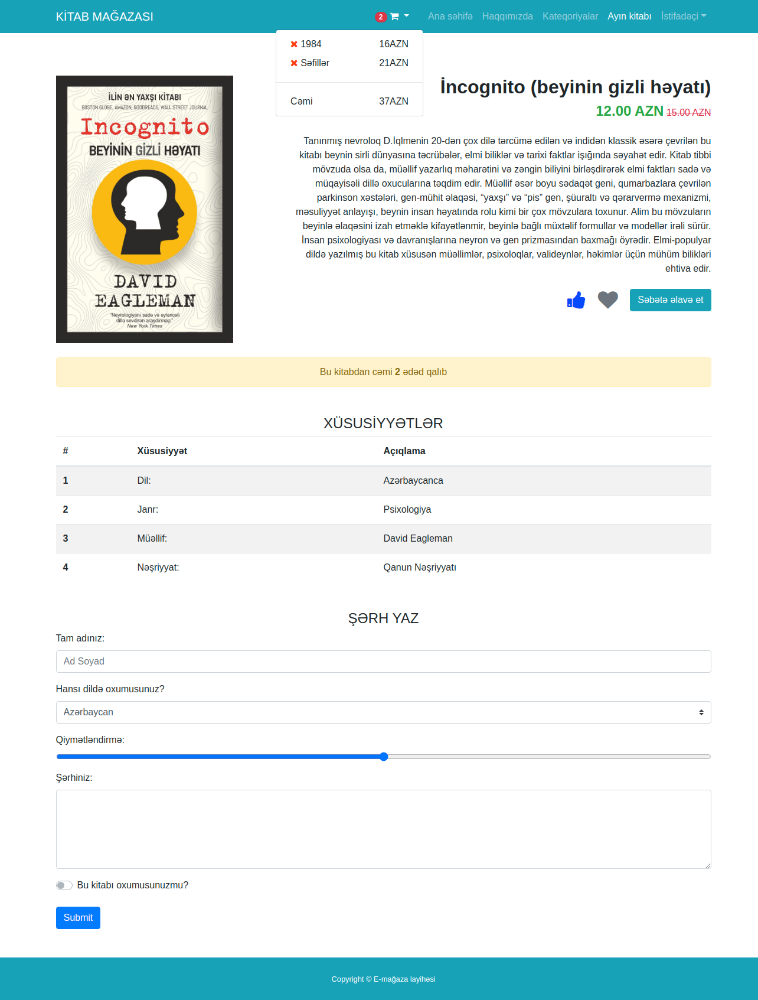
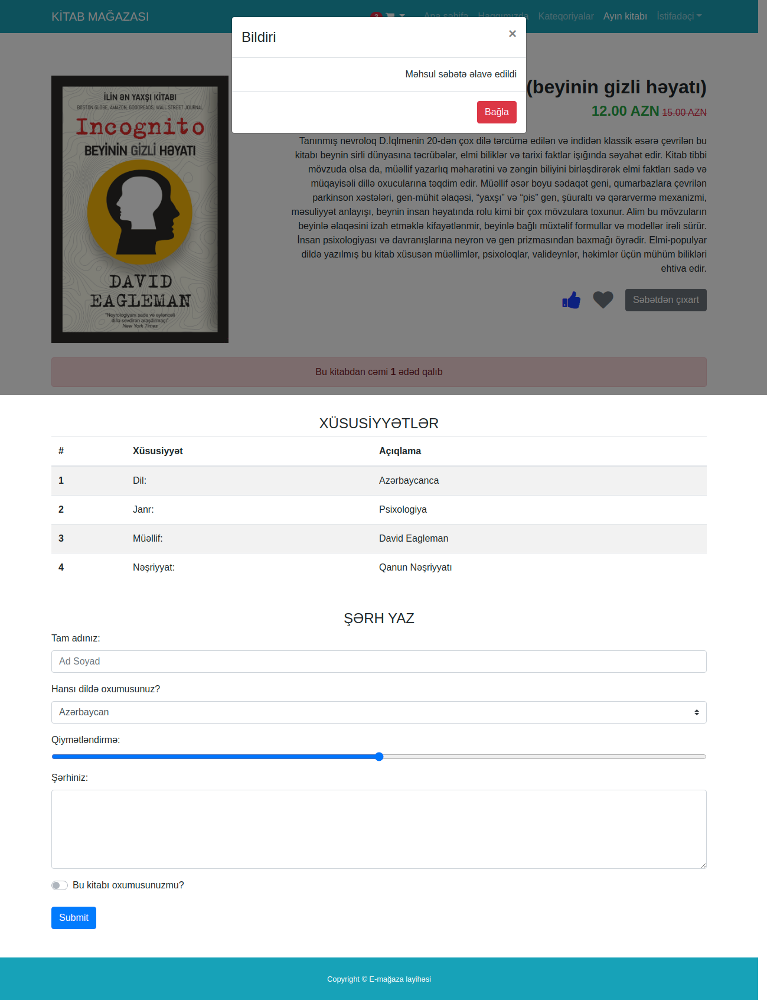
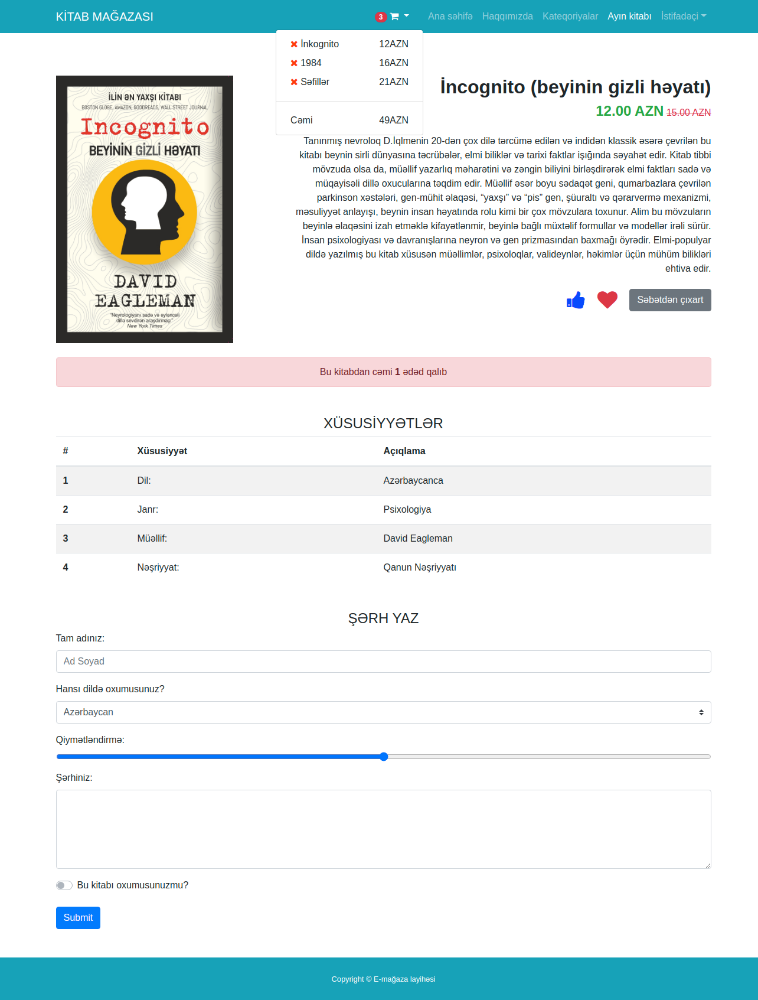

## E-commerce website

### 12.day tasks JS

#### Hand like
* When you click on the hand icon, the icon should turn upside down.

#### Heart like
* When you click on the gray heart icon, the page says 'Kitabı bəyəndiniz!' (as an alert) and the icon should be red.
* When you click on the red heart icon, the page says 'Bəyənməkdən imtina etdiniz!' (as an alert) and the icon should be grey.

#### Add to cart button
* By default, the menu should have a dropdown cart icon.
* When the dropdown opens, 2 books and the total price should be displayed as shown in the picture.
* The number of books in the cart should appear as a badge next to the cart icon.
* When you click the 'Səbətə əlavə et' button, the bootstrap modal should open and say 'Məhsul səbətə əlavə edildi'.
* The button should turn gray and the button should say 'Səbətdən çıxart'.
* The book on the page must be added to the cart.
* Both the badge and the inside of the cart should change.
* The number in the alert must be reduced to 1 and the alert must be a danger.
* When you click on the 'Səbətdən çıxart' button, the bootstrap modal should open and type 'Məhsul səbətdən çıxarıldı' inside.
* The button should return to its previous color and the button should say 'Səbətə əlavə et'.
* Both the badge and the inside of the cart should change.
* The number in the alert must be increased to 2 and the alert must be a warning.

<a href="https://www.figma.com/file/Feq8Q12N9vwHAtEdcBMUTH/Untitled?node-id=3%3A2">Page figma file.</a>

### Page pictures

### Product page

### Product page
