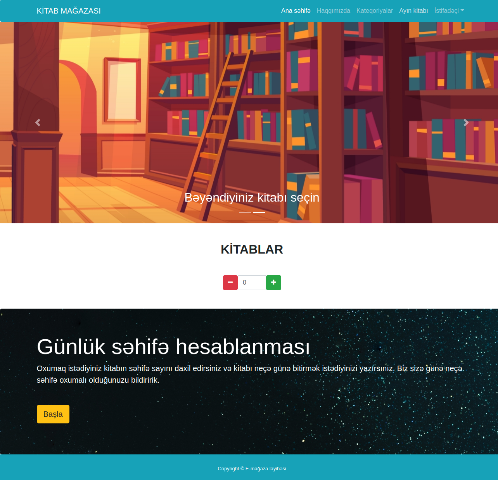
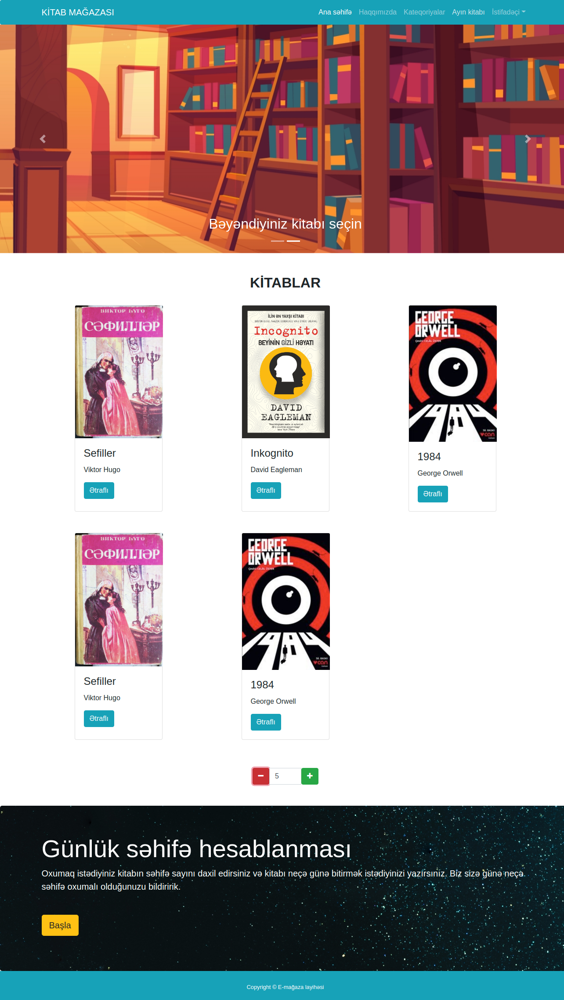
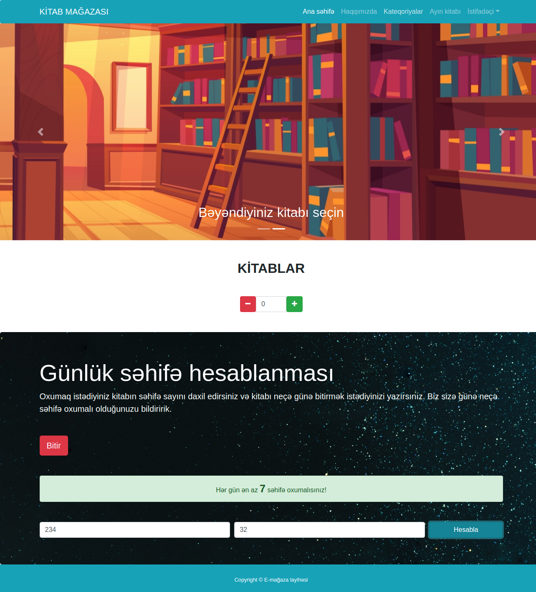

## E-commerce website

### 14.day tasks jQuery

#### Book counter
* You must select 6 book pictures, title and author.
* By default, no book should appear on the page.
* The page should simply have a counter like the one in the picture.
* Books should appear randomly on the page as you click the Plus button.
* No book should come twice in a row.
* When you click the minus button, the last added book should be deleted.
* The number on the counter indicates the number of books on the page, this number should not fall below zero.

#### Pages per day
* When you click on the Jumbotron's 'Başla' button, a form like the one in the picture should open.
* When you enter the appropriate numbers and click on the 'Hesabla' button, the result should appear on the page as a bootstrap success alert.
* If the calculation is not possible, a danger alert written 'Hesablamada xəta baş verdi!' should appear on the screen.
* When you click on the 'Bitir' button, the extra openings must be closed.

<a href="https://www.figma.com/file/TqCHxXdUJtLa8eb0NLCIos/Untitled?node-id=1%3A2">You can get the fonts and exact sizes from the figma file.</a>

### Page images

