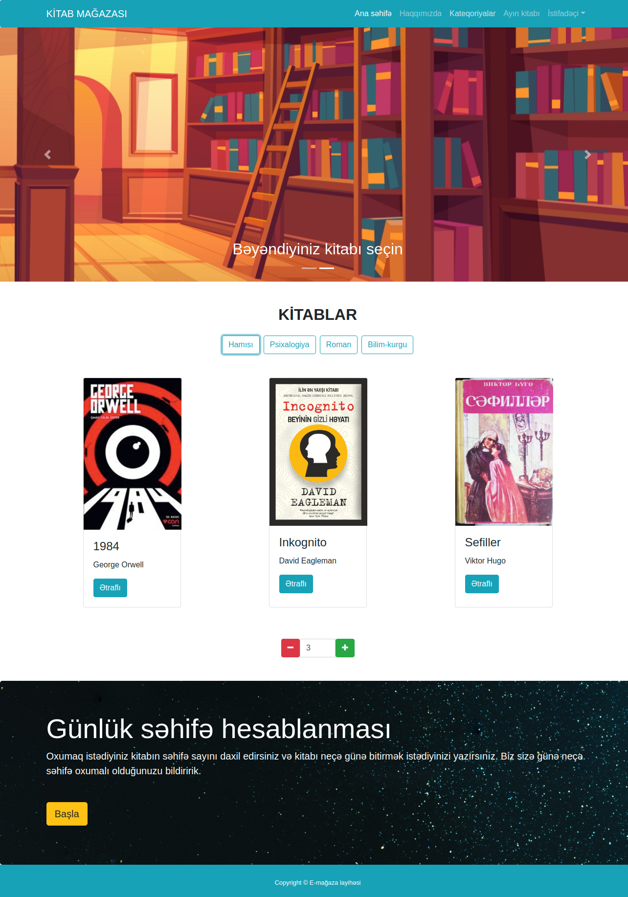
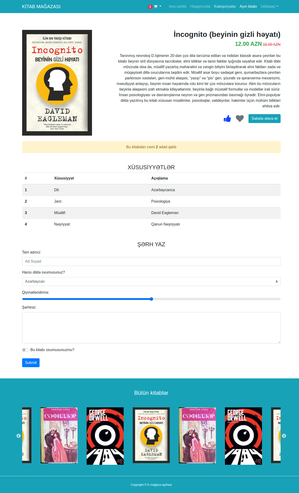

## BeginnerSE third sprint project: E-commerce website

### 15.day tasks

#### Home page filter
* Ana səhifədə kateqoriyaya görə filter düzəldilməlidir.
* Hansı kategoriyaya kliklənsə ekranda sadəcə o kategoriyaya aid kitablar görsənməlidir.
* When you add a book, a book cannot come twice.
* If the books run out, the number on the counter should not increase.

#### Product page slider
* A slider should be made as shown in the picture.
* Slick slider plugin must be used.

### Home page

### Product page

