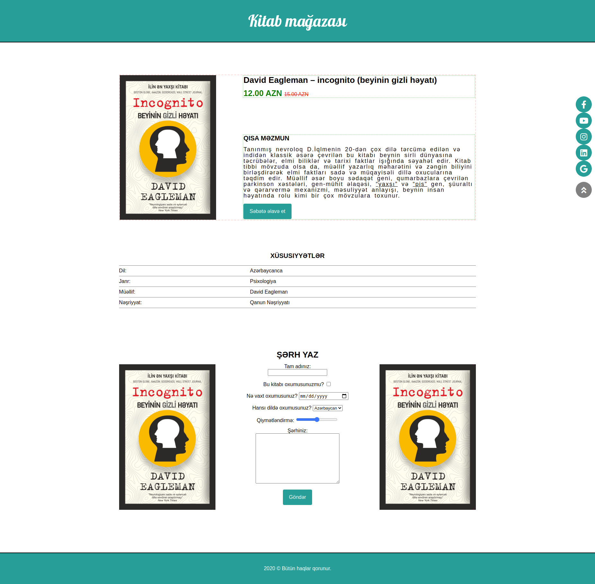

## E-commerce website

### 3.day tasks

* css must be reset
* There is a black border line at the bottom of the header section, just below
* The picture, title and content of the book should be arranged as shown, and imaginary borders should be drawn on these parts so that the arrangement is clearly visible. This part should be done with the help of positions
* The rows in the table must be separated by a border (If you can't do it completely, it's not a problem, we will touch on this issue again on the 5th day)
* Icons should be added to social networks (Font awesome)
* Social network icons should remain fixed on the right side of the page, the icons should not change position as the page moves

### 3.day questions

* Write your answers to the answers.txt file in this folder.
* Explain in your own words, in your own language
* Why we need CSS reset?
* What are the advantages of using fonts instead of images as icons?

<a href="https://www.figma.com/file/W2EP5MNgtzc1g1NoSqqOmK/Untitled?node-id=1%3A2">You can get the fonts and exact sizes from the figma file.</a>

