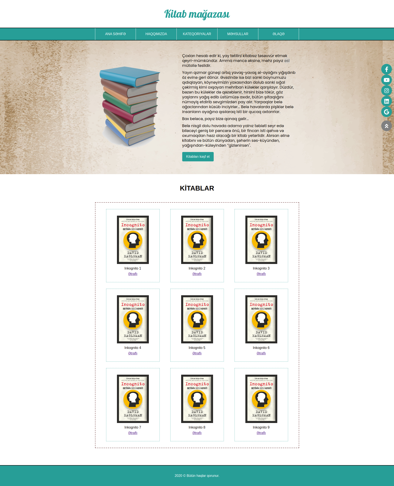

## BeginnerSE first sprint project: E-commerce website

### 4.day tasks

* Should be processed on the index.html file and the page shown in the image should be retrieved one by one
* The menu section must be prepared using Flex
* 1px white border should be placed on the right and left sides of the menu items (The borders between them will look thick, this is not a problem, we will solve it in the next lesson)
* A background image will be placed in the section below the menu. The picture and text of the book will be brought along with Flex and will be averaged in height (images are available in the assets/images folder)
* The Html structure of the book section should have a container div and a 9 item div inside. It should be brought to the shape shown in the picture using Flex. (Borders should be placed around both the container and the items so that the locations of the items are clearly visible.)
* When you click on the detailed link, the product page with the task of the 3rd day should open.
* Icons should be added to social networks (Font awesome)
* Social network icons should remain fixed on the right side of the page, the icons should not change position as the page moves (This task should be solved using the position)

### 4.day questions

* Write your answers to the answers.txt file in this folder.
* Explain in your own words, in your own language
* What are the advantages of using Flex?

<a href="https://www.figma.com/file/QcbEa4tEXK6RteQTqX0IkE/Untitled?node-id=1%3A2">You can get the fonts and exact sizes from the figma file.</a>

