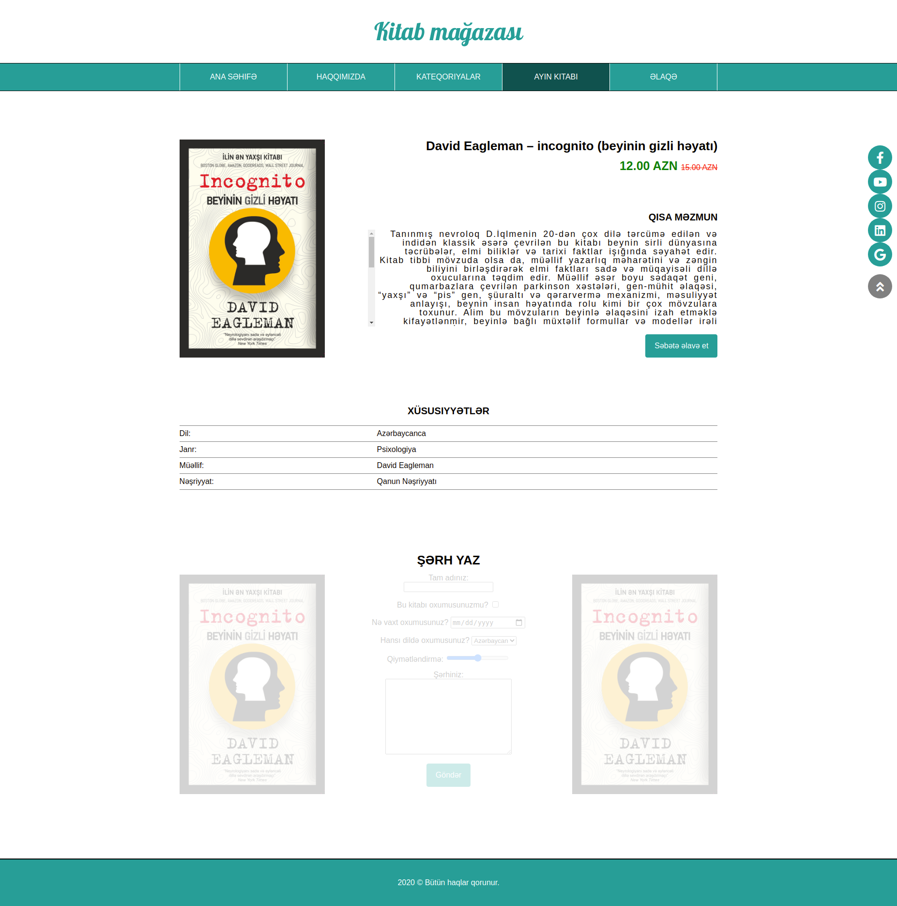
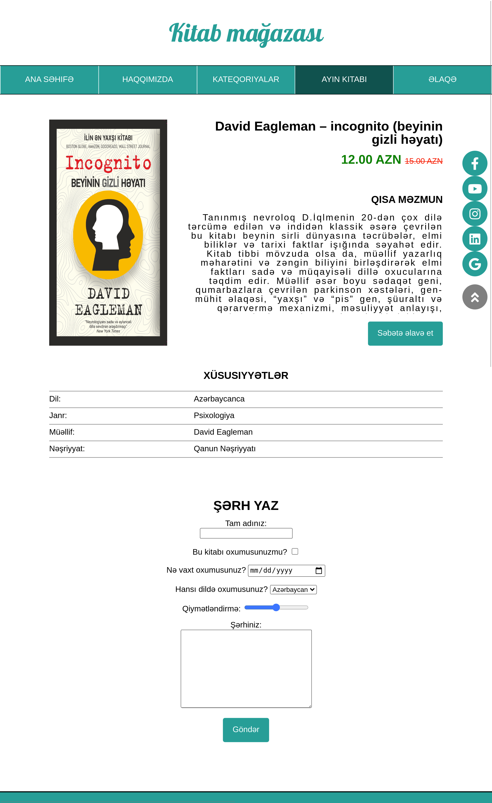
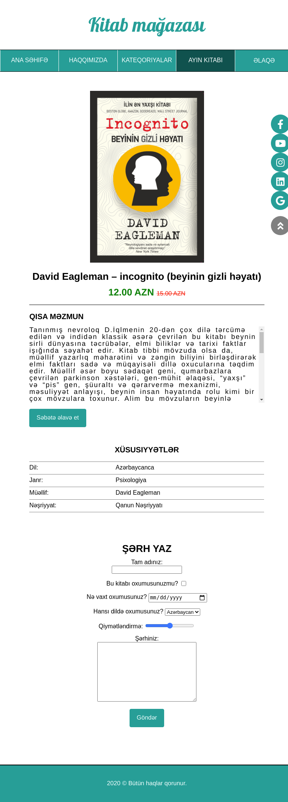
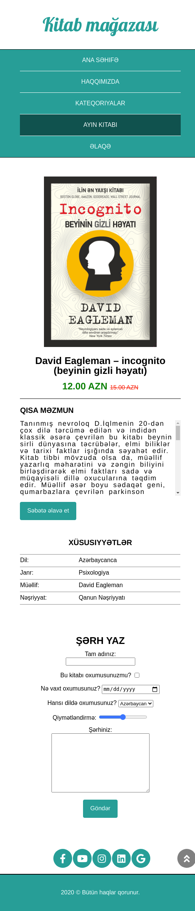

## E-commerce website

### 6.day tasks

#### In today's tasks, the page created in Sprint1 day5 should be responsive by media queries.
#### When the screen is wider than 1024px
* The margin on the right and left of all parts must be 20%

#### When the screen size is less than 1024px
* Menu section width should be full screen width
* The margin on the right and left of all other parts must be 10%
* Background images and transparency should be removed in the comments section

#### When the screen size is less than 768px
* Book, title, price parts must be full page and averaged
* Part of the content should come under these sections and the scroll should be on the right

#### When the screen size is less than 600px
* Menu sections should be as shown in the picture and the white border should be only in between
* Social network buttons should be centered at the bottom (as in the picture)

<a href="https://www.figma.com/file/5RpyjHqvk69GodpvkZPXKA/Untitled?node-id=1%3A2">You can get the fonts and exact sizes from the figma file.</a>

### Screen > 1024

### Screen < 1024

### Screen < 768

### Screen < 600

