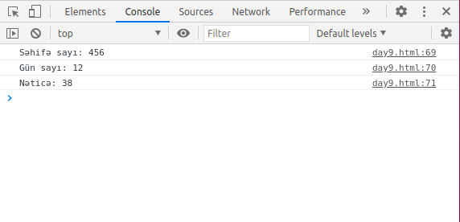

## E-commerce website

### 9.day tasks

* A new page should be prepared as shown. (With bootstrap classes)
* Menu Ana səhifə, Ayık kitabı sections should work and redirect to the appropriate pages.
* This page should open when you click on the jumbotron button on the home page.
* When the page is opened, the user should be asked about the number of pages of the book and how many days the book should be completed. (JS prompt)
* After the user enters this information, the minimum number of pages per day should appear on the screen (JS alert). As an integer.
* Also every 3 digits should appear on the console. (JS console log)
* If the user enters a word instead of a number or a division occurs to zero, the message "Hesablamada problem baş verdi" should appear on the screen (JS alert)

#### Questions
* Write your answers to the answers.txt file in this folder.
* Explain in your own words, in your own language
* What is JavaScript and what does it do? (explain broadly)
* Could we create today websites without JavaScript? Why?

<a href="https://www.figma.com/file/dFSOYAdeO9LR15tM3cgm4m/Untitled?node-id=2%3A555">You can get the fonts and exact sizes from the figma file.</a>

### Page

### First prompt

### Second prompt

### Alert

### Console
